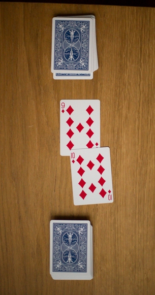

<!--
*** Thanks for checking out the Best-README-Template. If you have a suggestion
*** that would make this better, please fork the repo and create a pull request
*** or simply open an issue with the tag "enhancement".
*** Thanks again! Now go create something AMAZING! :D
***
***
***
*** To avoid retyping too much info. Do a search and replace for the following:
*** github_username, repo_name, twitter_handle, email, project_title, project_description
-->

<!-- TABLE OF CONTENTS -->

  
<h2 style="display: inline-block">Table of Contents</h2>

  <ol>
    <li>
      <a href="#about-the-project">About The Project</a>
      <ul>
        <li><a href="#built-with">Built With</a></li>
      </ul>
    </li>
    <li>
      <a href="#getting-started">Getting Started</a>
    </li>
    <li><a href="#acknowledgements">Acknowledgements</a></li>
  </ol>

<!-- ABOUT THE PROJECT -->
## About The Project

This project is an implementation of the card game "War". Here is a [link](https://www.youtube.com/watch?v=J5vT33Vo04s) to understand how the game is played. The War-1 file simulates a full game.

### Built With
  Java 8

<!-- GETTING STARTED -->
## Getting Started

These 4 files are needed to run the program. All you need to do is have all the files in the same package. The War-1 class can then be compiled and a simulation of the game will start! Enjoy. 

### Prerequisites

All you need is any Java IDE

<!-- ACKNOWLEDGEMENTS -->
## Acknowledgements
  Thanks to Othneil Drew for providing this tempate link below. 
* [Template](https://github.com/othneildrew/Best-README-Template/blob/master/BLANK_README.md)
